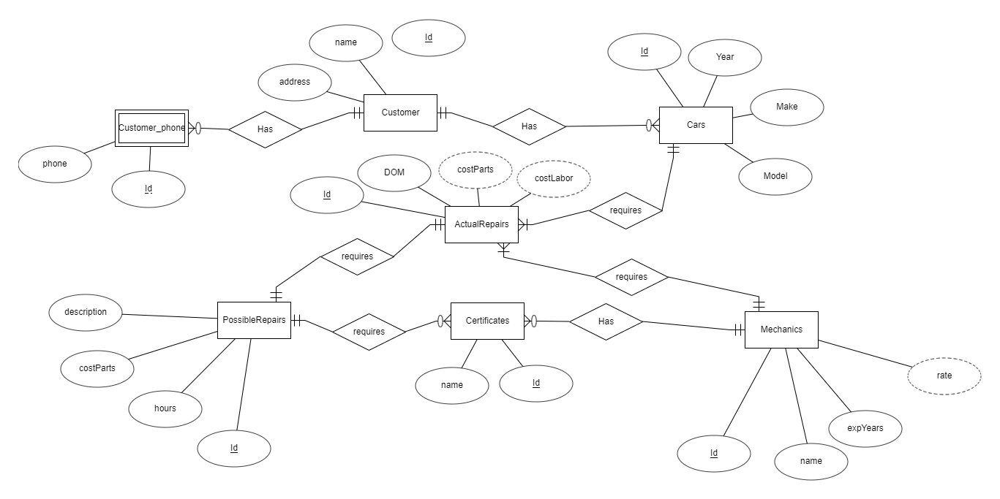
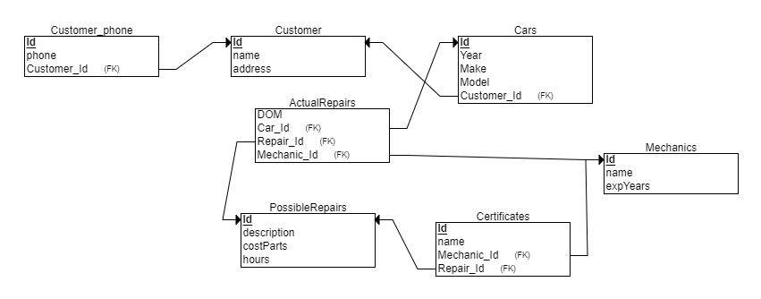

# SQL Injectors CS4604 Project

## Team Members
* Eric Wynn (weric16)
* James Hopkins (jhopkins)
* Zachery Smith (zacs97)

## Project Description

Over the course of this semester you will be developing an application to manage the data for an auto repair business. 
The scenario is that Hot Wheels Auto Repair has decided they would like to move into the 20th century. 
They have commissioned your group to develop a solution that will help them keep track of things. 
They aren't real trusting of computers or technology, so they're going to start you out small to give you time to prove yourself. 
Over time, if they like what they see, they'll give you more work.

## Entity Relationship

A *Customer* is identified by its *Id* and has contact information including one or more phone numbers, a name, and an address.

A Customer owns a *Car* which is brought into the shop. *Cars* include a unique *Id*, and the year, make, and model of the car. 

*ActualRepairs* are performed on the car. This entity holds information about the repairs that are being done on a specific car, 
including a unique *Id*, the Date of Maintenance, the cost of parts, and the cost of labor. 

*PossibleRepairs* serves as a list of repair types that can be done on a Car. 
The entity consists of a unique *Id*, a description of the repairs, the cost of parts for the repair, and the amount of hours expected. 

*Certificates* are required to carry out certain repairs. These are identified by a unique *Id* and a name. 

*Mechanics* have Certificates and also carry out ActualRepairs. They are tracked by a unique *Id*, and have a name, experience level, and hourly rate. 

## Relational

The diagram below shows the ER Diagram converted to a relational schema.

The corresponding sql can be found [here](sql/install.sql).

## Build/Install/Run

### Docker Playground
Go to the [Docker Playground](http://play-with-docker.com) and confirm that you are not a robot.  
In the left-hand menu, click on "ADD NEW INSTANCE"  
This will start a Docker instance (node) and log you in as the root user. 
Execute the following command:

`curl -o runme.sh -H "PRIVATE_TOKEN: re787JwGwy-fW2TeWAcA" "https://code.vt.edu/api/v4/projects/3785/repository/files/runme.sh/raw?ref=master" && bash ./runme.sh`

This will start up a container listening on port 8080. Notice at the top of the page next to the
node's IP address there is now a link labeled **8080**. Click on that link to use the application.

### Linux

[Install Docker](https://docs.docker.com/install/#supported-platforms) on your favorite Linux machine.
Open a terminal, change directory into some work location and execute the following command:

`curl -o runme.sh -H "PRIVATE_TOKEN: re787JwGwy-fW2TeWAcA" "https://code.vt.edu/api/v4/projects/3785/repository/files/runme.sh/raw?ref=master" && bash ./runme.sh`

